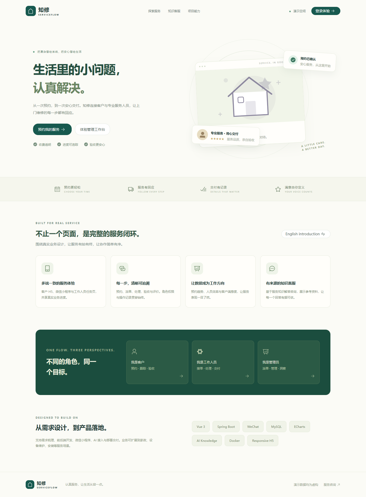
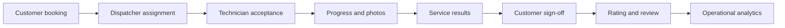
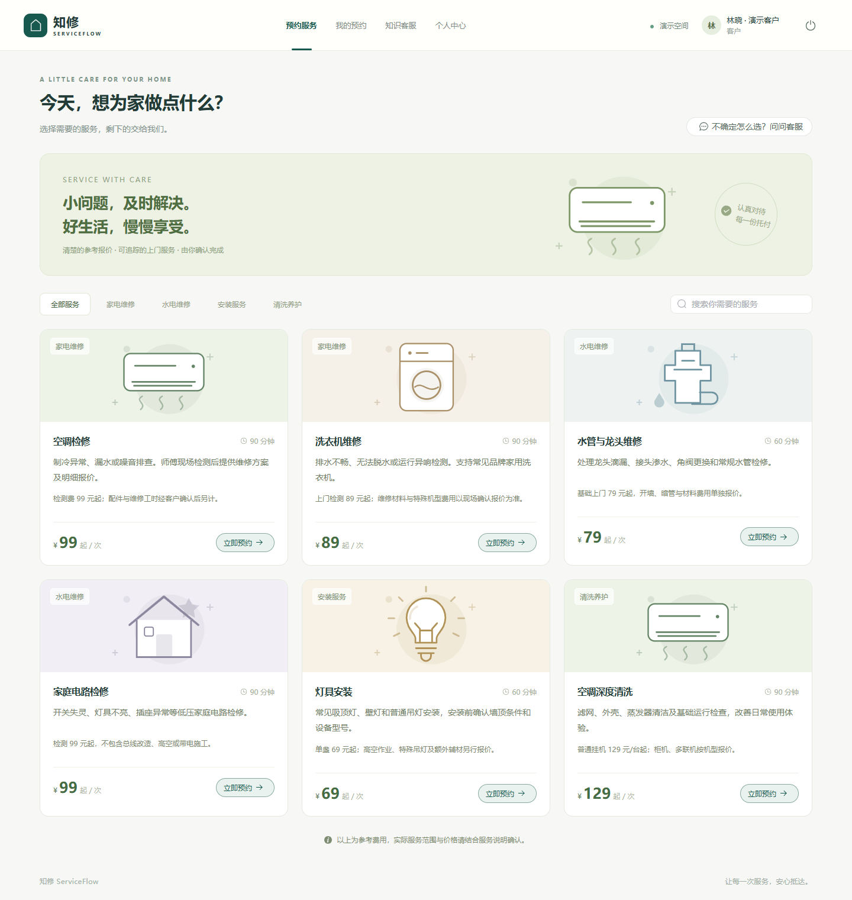
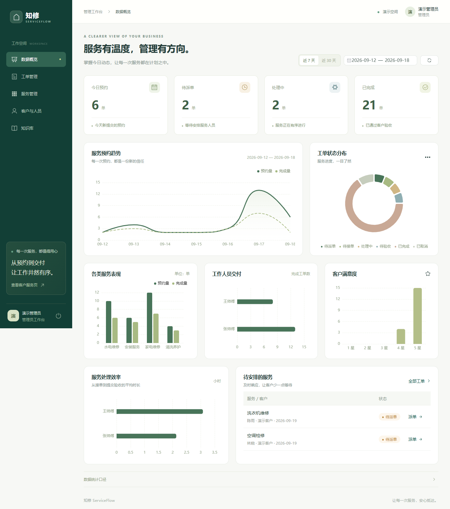
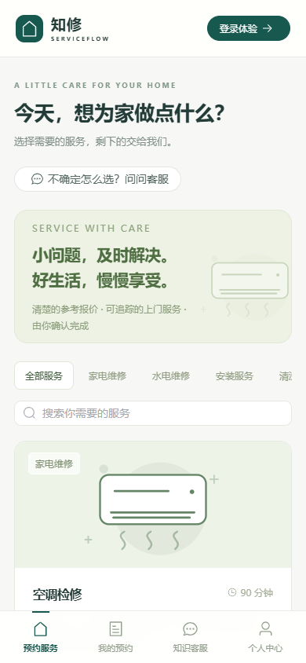
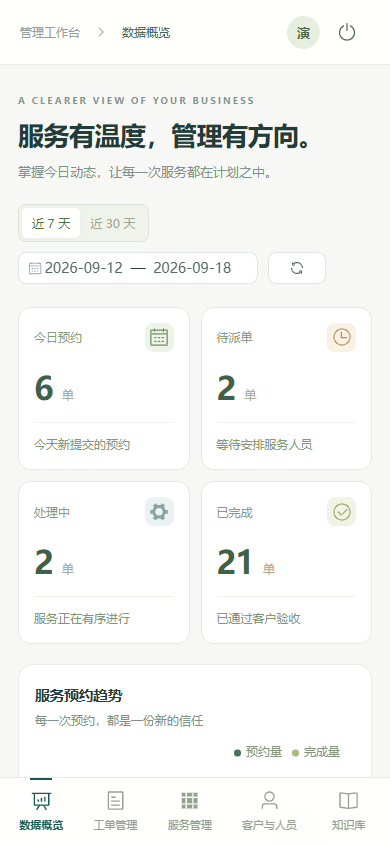

# ServiceFlow · 知修

**Field service operations, from booking to customer sign-off.**

[中文](README.md) · English

ServiceFlow is a multi-client booking and work order management system for home repair, installation, cleaning and maintenance. It connects customers, technicians and dispatchers in one traceable workflow, demonstrating product scoping, frontend and backend development, a WeChat client and operational analytics.

> This public portfolio repository contains product documentation, actual interface screenshots and a workflow recording. The complete application source is retained by the project owner and is not published in this repository. There is currently no publicly accessible business demo. Screenshots and the recording use fictional business data.

[Watch the workflow recording](assets/video/serviceflow-demo.webm) · [User guide (Chinese)](docs/user-guide.zh-CN.md) · [Architecture (Chinese)](docs/architecture.md) · [Demo guide (Chinese)](docs/demo-guide.md) · [Verification record (Chinese)](docs/verification.md)

## A complete service workflow

| Operational need | ServiceFlow capability |
| --- | --- |
| Collect complete booking details | Service, appointment slot, contact, address, problem description and photos |
| Make ownership clear | Dispatcher assignment, technician acceptance, return and reassignment before acceptance |
| Keep customers informed | Personal order history, progress records, onsite photos and service results |
| Close the delivery loop | Technician submits results; customer accepts the work and leaves a rating and review |
| Understand performance | Booking trends, work order distribution, technician efficiency and satisfaction charts |
| Answer recurring questions | Published business knowledge and an optional model integration with reference sources |

## Roles and interfaces

| Role | Core features | Interface |
| --- | --- | --- |
| Customer | Browse services, book, follow progress, cancel eligible orders, accept and review, maintain profile and addresses | Responsive web and native WeChat customer mini program |
| Technician | Assigned tasks, acceptance or return, progress notes, photos, submission for acceptance | Responsive web |
| Administrator | Assignment and reassignment, service catalog, account management, knowledge publishing, analytics | Responsive web |

The backend validates roles, resource ownership and state transitions. Customers access their own orders; technicians access tasks currently assigned to them.

## Actual product screens

### Customer service catalog

Customers can inspect service descriptions, indicative prices and price conditions before selecting an appointment slot and submitting a booking.

### Management dashboard

The dashboard shows booking and completion trends, current order states, service categories, technician delivery, processing time and rating distributions. It supports 7-day, 30-day and custom date ranges and uses business API data.

### Responsive web on mobile

  
  

These are mobile web screenshots. The native WeChat customer mini program is a separate client and has not been publicly released. See the [demo guide](docs/demo-guide.md) for order details, technician tasks, acceptance, reviews and the knowledge interface.

## Technology and delivery scope

| Layer | Technology | Scope |
| --- | --- | --- |
| Web | Vue 3, Element Plus, ECharts | Role-specific workspaces, responsive UI, business charts |
| Backend | Java 17, Spring Boot | Shared APIs, role and ownership checks, work order transitions |
| Data | MySQL; H2 demo mode | Relational data and persistent demo data |
| WeChat | Native mini program | Customer bookings, orders, profile, addresses and knowledge access |
| Knowledge assistant | Chat Completions compatible model interface | Published knowledge retrieval and reference material; explicit unavailable state without a configured model |
| Deployment design | Docker Compose, Nginx | Deployment configuration and documentation; container runtime verification remains pending |

The complete project covers workflow design, API design, frontend and backend implementation, multi-client integration, access control, verification and handover documentation.

## Current status and limits

As of **September 18, 2026**, the core web workflow, management functions, mobile layouts, backend tests and a MySQL workflow have been verified locally. The WeChat client has passed static checks, request adapter tests and native offline compilation.

- **Recorded checks:** 16 backend test groups, 13 browser workflow checks and 8 management feature checks; 11 pages checked for overflow at a 390px viewport.
- **Still pending:** live model quality and cost evaluation, WeChat simulator and device testing, container build and runtime verification, public deployment and platform release.
- **Outside the first release:** online payments, WeChat one-tap login, notifications, coupons, complex settlement, capacity scheduling and English business interfaces.

The interface is currently in Chinese. These checks establish a local validation scope and do not imply a production launch. Environment details and limitations are documented in the [verification record](docs/verification.md).

## Documentation and media

| Resource | Contents |
| --- | --- |
| [User guide](docs/user-guide.zh-CN.md) | Customer, technician, administrator and WeChat workflows; in Chinese |
| [Architecture](docs/architecture.md) | Components, shared business boundaries, access and work order states; in Chinese |
| [Demo guide](docs/demo-guide.md) | Presentation sequence, screenshots and a silent recording; in Chinese |
| [Verification record](docs/verification.md) | Completed checks and remaining validation; in Chinese |
| [Rights notice](NOTICE) | Rights and usage boundaries for the public materials and private source |

## Collaboration

Available project directions include custom workflows for repair, installation, domestic services and equipment maintenance; product scoping; UI design; frontend and backend development; WeChat mini programs; model integration; deployment and ongoing maintenance.

To discuss a project, describe your use case, user roles, essential features, expected timeline and existing systems. Source delivery, usage rights, deployment resources, maintenance and fees are agreed for each engagement.

For collaboration inquiries, please use the public contact information on [the author's GitHub profile](https://github.com/sqq332).
