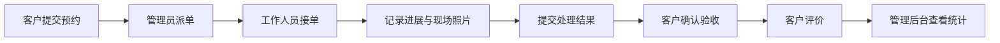

# 知修 ServiceFlow

**让上门服务从预约、派单到验收，全程有记录。**

中文 · [English](README.en.md)

**[打开在线作品页](https://sqq332.github.io/serviceflow-showcase/)**：浏览界面图廊、播放流程视频并查阅项目文档。

面向维修、安装与清洗养护场景的多端服务预约与工单管理系统。连接客户、工作人员与管理员，展示从业务流程设计、前后端开发到微信小程序和数据分析的完整交付能力。

> 这是公开作品展示仓库，收录产品介绍、真实界面截图、流程录像和使用文档。完整业务源码不在本仓库公开，由项目所有者保留。当前未提供可公开登录的业务演示站点；截图与录像使用虚构业务数据。

[观看业务流程录像](assets/video/serviceflow-demo.webm) · [使用手册](docs/user-guide.zh-CN.md) · [技术架构](docs/architecture.md) · [演示指南](docs/demo-guide.md) · [验证记录](docs/verification.md)

## 从分散沟通，到可追踪的服务过程

| 业务需求 | ServiceFlow 提供的支持 |
| --- | --- |
| 把预约信息收集完整 | 服务、日期时段、联系人、地址、问题描述与照片统一提交 |
| 明确任务由谁负责 | 管理员派单，工作人员接单；支持接单前重派与退回 |
| 让客户了解服务进展 | 客户查看本人订单、现场照片、处理说明与进度记录 |
| 形成服务交付闭环 | 工作人员提交结果，客户确认验收，再完成星级与文字评价 |
| 了解服务表现 | 预约趋势、工单分布、人员效率与客户满意度集中展示 |
| 减少重复业务咨询 | 公开知识库与可选模型接口，回答可展示参考知识来源 |

## 三个角色，一条业务流程

| 角色 | 主要功能 | 入口 |
| --- | --- | --- |
| 客户 | 浏览服务、提交预约、查询进度、取消预约、验收评价、维护资料与地址 | 响应式网页、微信客户小程序 |
| 工作人员 | 查看本人任务、接单或退回、记录进展与照片、提交验收 | 响应式网页 |
| 管理员 | 派单与重派、服务分类与上下架、账号维护、知识库管理、数据概览 | 响应式网页 |

服务端统一校验角色、订单归属和状态变化。每位客户查看自己的订单，工作人员访问当前分配给自己的任务。

## 真实界面

### 客户：找到服务，提交预约

服务目录展示服务说明、参考价格与适用条件。预约支持日期时段、常用地址和问题照片，详情页持续记录服务进展。

### 管理员：看清业务进展与服务表现

数据概览支持近 7 天、近 30 天和自定义日期范围，呈现预约与完成趋势、状态分布、服务类别、人员交付、处理时长和评价分布。图表使用实际业务接口数据。

### 移动网页：客户与管理员都能使用

  
  

上图为响应式网页截图。微信客户小程序是独立的原生客户端，当前尚未公开发布。更多订单、人员任务、验收评价及知识客服截图见[演示指南](docs/demo-guide.md)。

## 技术与交付能力

| 层级 | 技术 | 展示能力 |
| --- | --- | --- |
| 网页端 | Vue 3、Element Plus、ECharts | 三角色工作台、响应式界面、业务数据可视化 |
| 服务端 | Java 17、Spring Boot | 统一业务接口、角色与资源权限校验、工单流转 |
| 数据存储 | MySQL；H2 演示模式 | 关系数据建模、演示数据与持久化 |
| 微信端 | 原生微信小程序 | 客户预约、订单、个人资料、地址与知识客服 |
| 知识客服 | 兼容 Chat Completions 的模型接口 | 检索公开业务资料、展示参考来源、模型未配置时明确提示 |
| 部署方案 | Docker Compose、Nginx | 应用部署配置与交付文档；容器运行尚待实测 |

完整项目体现需求梳理、流程设计、接口设计、多端开发、业务权限控制、测试验证与交付文档编写。更多边界与组件关系见[技术架构](docs/architecture.md)。

## 当前完成情况

截至 **2026 年 9 月 18 日**，本地已验证网页预约工单闭环、后台管理、手机布局、后端测试及 MySQL 环境中的核心流程；微信小程序已通过静态检查、请求适配器测试与原生离线编译。

- **已验证**：16 组后端测试、13 项浏览器主流程检查、8 组管理功能检查；11 个页面在 390px 手机宽度下无横向溢出。
- **尚待实际环境验收**：真实模型回答质量与费用、微信模拟器与真机、容器构建运行、公网部署和平台发布。
- **首版之外**：在线支付、微信一键登录、通知推送、优惠券、复杂结算、产能排班和英文业务界面。

以上是有范围的项目验证记录，不代表已完成生产上线。具体环境、统计数字和限制见[验证记录](docs/verification.md)。

## 文档与媒体

| 资料 | 内容 |
| --- | --- |
| [用户使用手册](docs/user-guide.zh-CN.md) | 客户、工作人员、管理员和微信客户小程序的日常操作 |
| [技术架构](docs/architecture.md) | 多端结构、业务边界、权限与工单状态 |
| [演示指南](docs/demo-guide.md) | 讲解顺序、界面图集和无声录像 |
| [验证记录](docs/verification.md) | 已完成检查和后续实测项目 |
| [English overview](README.en.md) | English project introduction and delivery scope |
| [权利说明](NOTICE) | 展示资料与完整源码的使用边界 |

## 合作方向

可围绕维修、安装、家政与设备维护场景开展需求梳理、界面定制、前后端开发、微信小程序、业务系统改造、模型接口接入、部署交付与后续维护。

沟通时可说明业务场景、使用角色、必需功能、预计周期和已有系统。源码交付范围、使用权、部署资源、维护周期与费用按项目约定。

如需讨论合作，请通过 [作者 GitHub 主页](https://github.com/sqq332) 中的公开联系方式联系。
