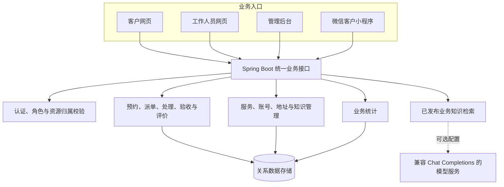
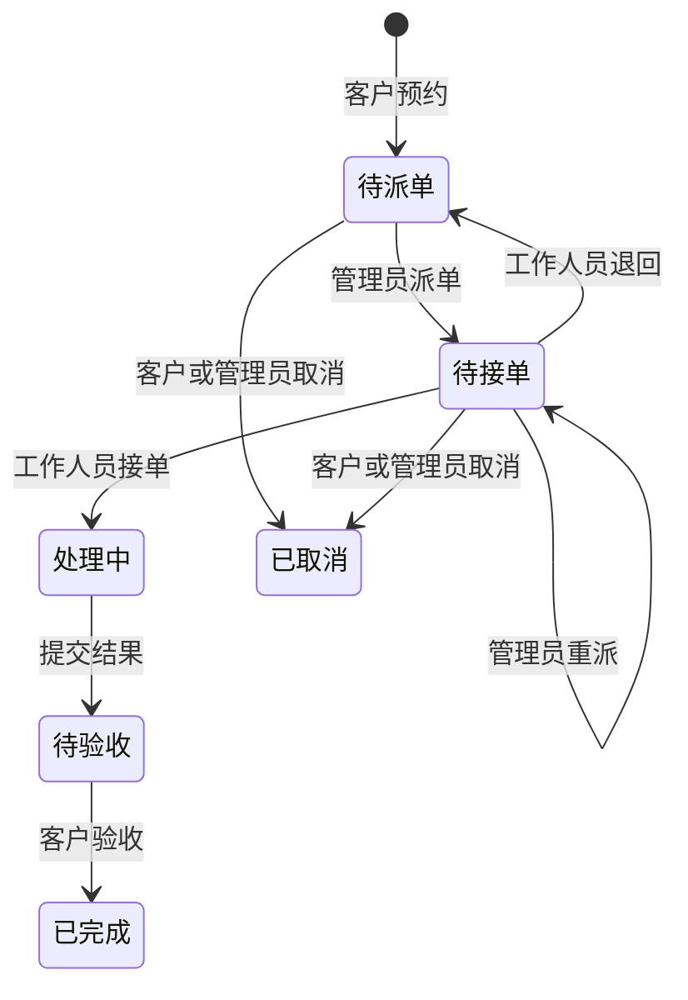

# 技术架构与业务边界

[返回项目首页](../README.md) · [使用手册](user-guide.zh-CN.md) · [验证记录](verification.md)

本页介绍 ServiceFlow 首版的组成与设计。公开仓库用于展示，完整业务源码和部署配置不在本仓库公开，由项目所有者保留。

## 多端共用业务服务

网页使用 Vue 3、Element Plus 与 ECharts；服务端使用 Java 17 与 Spring Boot。数据库支持 MySQL，演示环境提供 H2 持久化模式。微信端为原生客户小程序，工作人员和管理员使用响应式网页。

部署方案包含 Docker Compose 与 Nginx 配置，当前仅完成配置检查，尚未完成容器构建和实际启动验证。

## 主要业务模块

| 模块 | 责任 |
| --- | --- |
| 服务目录 | 分类、服务说明、参考价格与价格条件、上下架 |
| 预约与工单 | 日期时段、联系地址、问题描述与照片、指派、状态流转 |
| 现场处理 | 人员接单、退回、进展记录、现场照片、结果提交 |
| 验收与评价 | 客户确认服务完成，提交一次星级与文字评价 |
| 账号与资料 | 客户和工作人员账号、启停、个人资料与常用地址 |
| 业务知识 | 草稿、发布、下线、公开查询与可选模型问答 |
| 数据概览 | 预约和完成趋势、状态分布、服务与人员表现、处理效率和满意度 |

## 工单状态规则

客户评价发生在“已完成”之后，不产生新的工单状态。接单后当前不支持直接重派、退回或取消；待验收页面没有返工按钮。预约时段用于表达需求，首版不提供实时剩余名额和自动排班。

## 权限与一致性

- 客户访问本人订单和附件；工作人员访问当前指派给自己的工单；管理员按管理权限操作。
- 业务接口同时校验角色、资源归属和当前状态。退回或重派后，原工作人员失去该任务的访问权。
- 已记录的测试包括并发重复接单、派单与停用竞争、非法状态变化、附件绑定失败回滚、越权访问和令牌失效。
- 账号停用后已有登录也会失效；有未结束工单的工作人员不能直接停用。

这些设计与测试覆盖具体业务路径，不等同于已完成独立安全审计。完整检查范围见[验证记录](verification.md)。

## 知识客服边界

知识资料可以独立公开查询。配置模型服务后，系统检索管理员发布的业务资料，并在回答中展示参考知识来源。模型接口请求仅使用公开知识资料，相关协议已通过本地模拟服务验证。

当前没有配置真实模型服务，因此演示中的 AI 回答不可用；页面明确显示这一状态，资料查询仍可使用。真实模型效果、质量、费用和服务稳定性尚需实际环境验收。首版不以“已接入可用 AI”作为验收结论。

## 统计口径

数据概览按业务事件统计。预约趋势使用创建时间，完成趋势使用客户验收时间，处理时长从工作人员接单计算到提交结果；满意度统计所选验收日期范围内工单的现有评价。今日预约按北京时间计算。

当前待派单和处理中数量不随日期筛选变化。跨角色操作后需刷新页面取得最新状态，首版没有实时通知推送。

## 可扩展方向

现有流程可按实际业务扩展为家政、设备维护等服务系统。在线支付、排班容量、售后返工、消息通知、结算、微信一键登录与英文业务界面需要独立需求设计与验收，当前不属于首版完成范围。
