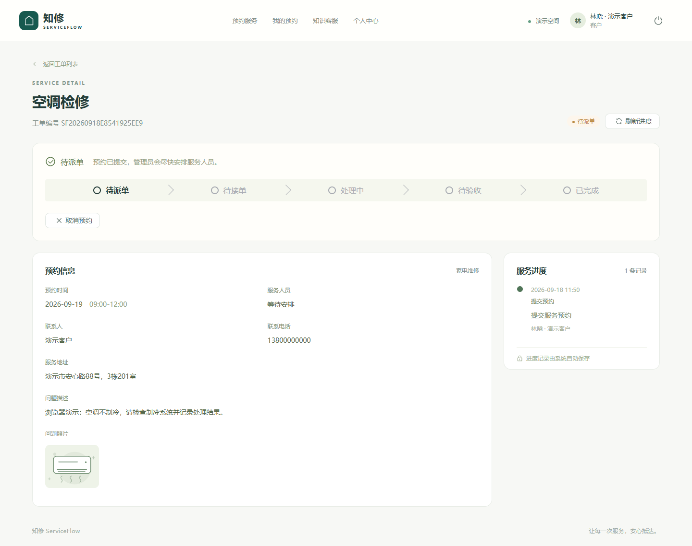
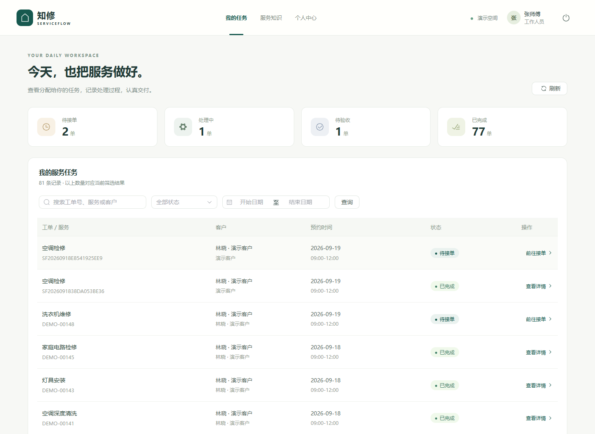
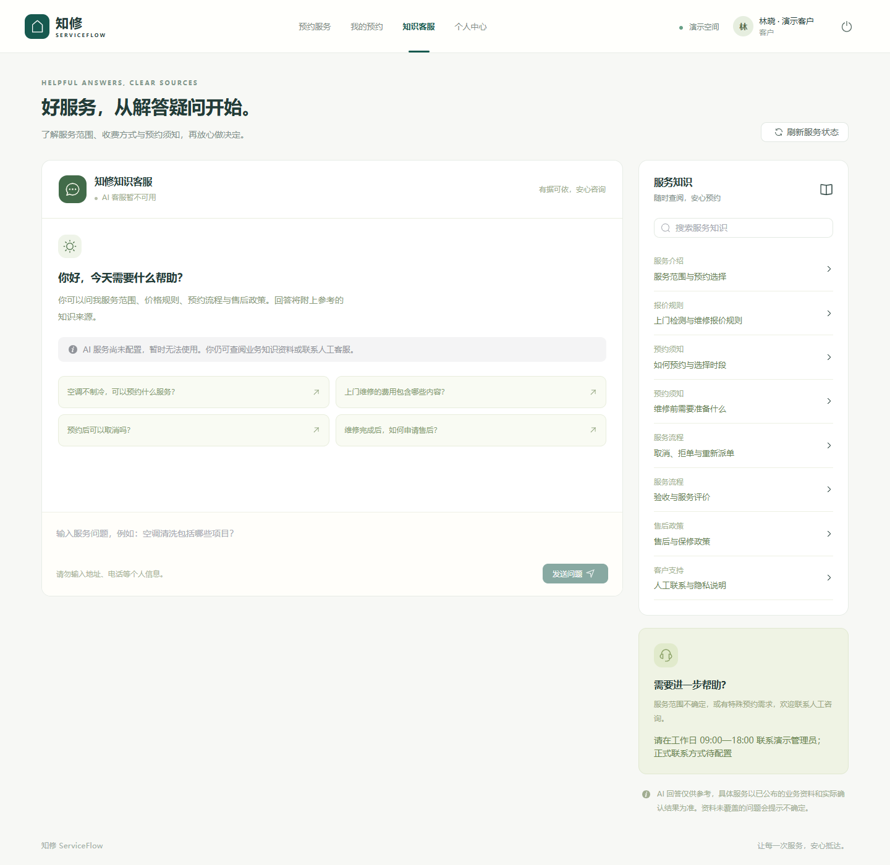

# 展示与演示指南

[返回项目首页](../README.md) · [使用手册](user-guide.zh-CN.md) · [验证记录](verification.md)

本仓库提供项目资料与媒体展示，当前没有可公开登录的业务演示站点。以下操作讲解适用于由项目负责人另行提供的演示环境；本仓库本身不启动业务系统。

## 看录像了解完整流程

[打开或下载 ServiceFlow 业务流程录像（WebM，无声）](../assets/video/serviceflow-demo.webm)

录像使用真实业务接口完成预约、派单、处理、验收和评价。人物、业务记录、联系方式与问题图片均为演示数据。不同浏览器对 WebM 的预览支持可能不同；不能直接播放时可下载后查看。

## 约两分钟讲解顺序

| 顺序 | 展示内容 | 讲解重点 |
| --- | --- | --- |
| 1 | 项目首页 | 面向上门服务，把客户、工作人员与管理员连接起来 |
| 2 | 客户浏览服务并预约 | 服务说明、日期时段、地址、问题描述与照片统一收集 |
| 3 | 管理员派单 | 明确负责人员；接单前可按规则重派 |
| 4 | 工作人员接单和处理 | 记录检查过程、现场照片与处理结果 |
| 5 | 客户验收评价 | 客户确认完成后提交星级与文字反馈 |
| 6 | 管理数据概览 | 查看预约、完成、人员交付与满意度变化 |
| 7 | 知识库与模型状态 | 展示可查阅的业务资料，说明真实模型尚未配置 |

演示时先记录同一工单编号，再按角色切换完成闭环。不同角色同时操作应使用独立浏览器会话，避免共用登录状态。操作后刷新相关页面查看最新进度与统计。

## 界面图集

### 01 · 项目首页

集中介绍业务场景、流程和产品能力。

### 02 · 客户服务目录

按分类和关键词查找服务，查看参考价格与适用条件。

### 03 · 预约详情

汇总服务、预约时段、地址、问题描述与当前进度。

### 04 · 工作人员任务

工作人员查看本人任务并按状态处理。

### 05 · 验收、评价与进度记录

展示处理结果、客户评价和按时间记录的服务过程。

### 06 · 知识客服

公开业务资料可以查询；模型未配置时明确显示 AI 不可用。

### 07 · 管理数据概览

展示预约趋势、状态分布、人员表现和满意度。

### 08–09 · 手机网页

下图为响应式网页，分别展示客户服务目录与管理概览，并非微信小程序截图。

  
  

## 展示时说明版本边界

网页核心流程已完成本地验证；微信客户端已通过原生离线编译，尚未完成模拟器操作、真机与发布验收。真实模型、容器运行和公网业务部署仍待验证。完整记录见[验证记录](verification.md)。

完整业务源码不在本仓库公开，由项目所有者保留；源码使用、交付和维护范围按合作约定。本仓库的资料与媒体适用[权利说明](../NOTICE)。
