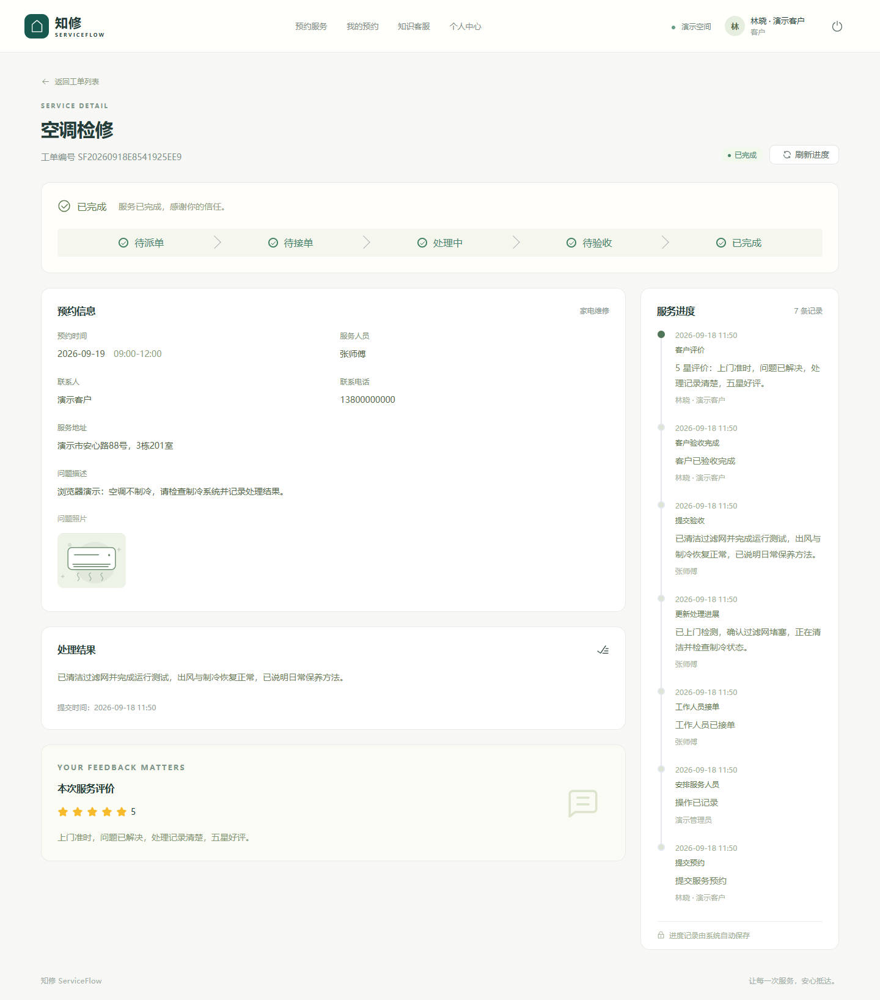

# 知修 ServiceFlow｜用户使用手册

[返回项目首页](../README.md) · [演示指南与视频](demo-guide.md) · [技术架构](architecture.md) · [验证记录](verification.md)

适用于首版客户网页、工作人员网页、管理后台和微信客户小程序。更新日期：2026 年 9 月 18 日。

本手册展示系统的日常操作与业务规则。本仓库没有可公开登录的业务演示站点，使用实际系统需要项目负责人提供访问入口和账号。完整业务源码不在本仓库公开，由项目所有者保留。

## 开始使用

登录后会根据账号角色显示不同入口。

| 身份 | 主要入口 |
| --- | --- |
| 客户 | 预约服务、我的预约、知识客服、个人中心 |
| 工作人员 | 我的任务、服务知识、个人中心 |
| 管理员 | 数据概览、工单管理、服务管理、客户与人员、知识库 |

手机网页的主要入口位于底部导航。桌面管理员的退出图标位于左下角，客户、工作人员和手机管理页面的退出图标位于右上角。切换身份时先退出，再登录其他账号。

同一浏览器中的标签页可能共用登录状态。同时演示多个角色时，应使用独立浏览器会话。

## 第一次完整体验

1. **客户提交预约**：在“预约服务”选择一项服务，点击“立即预约”，填写可用日期时段、联系人、地址和问题描述，点击“确认预约”，记下工单编号。
2. **管理员派单**：进入“工单管理”，打开这张待派单工单，点击“安排人员”，选择工作人员并“确认提交”。
3. **工作人员处理**：在“我的任务”打开工单，点击“确认接单”并确认；使用“记录进展”填写检查过程，处理后点击“提交验收”，填写结果并提交。
4. **客户验收评价**：返回“我的预约”，打开工单并刷新进度，检查结果，点击“确认验收完成”并确认；再点击“评价本次服务”，选择星级、填写体验并提交。
5. **管理员查看统计**：刷新“数据概览”，查看预约、完成数量和评价分布的变化。

工作人员提交结果后，需要客户确认，订单才会成为“已完成”。查看完整演示可使用[无声流程录像](../assets/video/serviceflow-demo.webm)。

## 客户：浏览服务与预约

在“预约服务”按分类或关键词查找服务，查看服务说明、参考价格、价格适用条件和预计时长。参考价格需结合服务内容与现场确认结果理解。

点击“立即预约”后填写以下内容。

| 项目 | 要求 |
| --- | --- |
| 预约日期 | 今天起 6 个月内；当天已结束的时段不可选择 |
| 上门时段 | 09:00–12:00、13:00–17:00 或 18:00–21:00 |
| 常用地址 | 可选择已保存地址，或填写本次预约地址 |
| 联系人、电话 | 填写便于工作人员联系的信息 |
| 服务地址 | 写明城市、街道、小区及门牌号 |
| 问题描述 | 说明设备、故障现象及使用情况，网页最多 3000 字 |
| 问题照片 | 选填，每次最多 6 张，每张不超过 5MB；支持 JPG/JPEG、PNG、WebP |

图片上传完成后，点击“确认预约”。成功后进入订单详情，状态为“待派单”。若提交失败，先按提示检查输入或刷新订单列表，确认是否已生成订单，再决定是否重新提交。

日期与时段表达服务需求，当前不显示实时剩余名额，也不自动安排工作人员班次。

## 客户：订单、取消、验收与评价

### 查询进度

进入“我的预约”，按状态、日期或关键词筛选并打开订单。详情可查看预约信息、当前工作人员、问题照片、处理结果和服务进度记录。点击“刷新进度”获取最新状态。

每位客户只能查看自己的订单。

### 取消预约

只有“待派单”和“待接单”状态支持客户取消。打开订单详情，点击“取消预约”，填写原因并“确认提交”。成功后状态为“已取消”；有新需求时重新预约。

进入“处理中”后不能直接取消。首版也不支持修改已提交预约的时间或地址：可取消的订单可取消后重新预约，其他情况需联系管理员协调。

### 验收与评价

订单进入“待验收”后，先检查处理说明和现场照片，确认服务完成，再点击“确认验收完成”并确认。成为“已完成”后，点击“评价本次服务”，选择 1–5 星、填写文字体验并提交。

每张订单只能评价一次，提交后不能修改。若问题尚未解决，应先联系工作人员或管理员核实；首版没有“退回返工”按钮。

### 维护资料与地址

在“个人中心”修改姓名、电话并“保存资料”。在“常用服务地址”点击“添加地址”，填写联系人、电话与详细地址并保存；已有地址可编辑或删除。

修改常用地址不会改写已经提交的订单地址。

## 工作人员：接单、处理与提交结果

进入“我的任务”，筛选并打开工单，检查预约日期、时段、地址和问题描述。工作人员只能访问当前分配给自己的任务。

### 接单或退回

- 可以承接时，点击“确认接单”并确认，订单进入“处理中”。
- 无法承接时，在“待接单”状态点击“退回任务”，填写原因并提交。工单回到“待派单”，等待管理员安排。

退回后返回任务列表，原工作人员失去这张工单的访问权。退回不会取消客户预约；接单后不能再通过退回功能撤销接单。

### 记录进展

在“处理中”状态点击“记录进展”，填写检查过程、处理措施或待办事项，可附现场照片，上传完成后提交。处理过程中可多次记录。

每次最多 6 张图片，单张不超过 5MB，格式要求与客户上传相同。客户与管理员可在服务进度中查看这些记录。

### 提交验收

服务处理完毕后点击“提交验收”，填写问题原因、处理方式与最终结果，按需上传现场照片并提交。订单进入“待验收”，由客户确认完成。

## 管理员：工单管理

在“工单管理”按状态、创建日期或关键词查找，打开详情查看预约信息、问题和进度。

| 操作 | 可操作状态 | 操作方法 |
| --- | --- | --- |
| 首次派单 | 待派单 | 点击“安排人员”，选择启用中的工作人员，可填派单说明，然后提交 |
| 更换人员 | 待接单 | 点击“重新派单”，选择另一位启用人员，然后提交 |
| 取消预约 | 待派单、待接单 | 点击“取消预约”，填写原因并提交 |
| 查看过程 | 有相应记录时 | 在详情查看照片、处理结果与服务进度 |

接单后首版不支持直接重派。重派后原工作人员不能再访问该任务，新工作人员需要确认接单。

## 管理员：服务、账号与知识库

### 服务与分类

进入“服务管理”，点击“新建分类”，填写名称和说明并保存；已有分类可通过编辑图标修改。

点击“新建服务”，填写名称、分类、服务说明、参考价格、预计时长和价格适用条件，选择上架或下架状态并保存。列表可编辑、上架或下架服务。

下架服务不能被新预约，历史工单仍可查询。客户目录只展示存在上架服务的分类。当前使用上下架管理服务，没有删除服务或分类的按钮。

### 客户与工作人员账号

进入“客户与人员”，可按姓名、用户名、电话搜索，并按角色和启用状态筛选。

| 操作 | 方法与边界 |
| --- | --- |
| 新建账号 | 选择客户或工作人员，填写用户名、初始密码、姓名和电话；初始密码至少 8 个字符 |
| 修改资料 | 点击“编辑”，修改姓名、联系方式等；不能修改已有账号的用户名与角色 |
| 启用或停用 | 按列表操作并确认；停用后账号不能继续访问，已有登录也会失效 |
| 查看关联业务 | 点击订单或任务数量，展开关联列表并查看详情 |

管理员及内置演示账号不能停用。有未结束工单的工作人员也不能停用，应先按业务规则处理任务。首版没有重置密码、修改角色或新建管理员的页面入口。

### 知识库

进入“知识库”，点击“新建资料”，填写标题、分类与公开业务内容，例如服务范围、报价条件、预约须知和售后规则。

标题最多 120 字，分类最多 40 字，内容最多 10000 字。暂不发布时保存资料，开启发布状态后可保存并发布。列表支持搜索、预览、编辑、发布、下线与删除。

已发布内容可被客户查阅并用于知识检索。下线后不再进入新的公开查询和检索，历史对话中已有的回答不会自动撤回。知识库只应包含可公开业务资料。

发布资料不会自动启用 AI，模型问答还需要配置实际模型服务。

## 管理员：理解数据概览

进入“数据概览”，选择“近 7 天”“近 30 天”或自定义日期，点击刷新获取最新数据。

| 指标 | 含义 |
| --- | --- |
| 今日预约 | 北京时间今天创建的预约，包含后来取消的订单 |
| 待派单、处理中 | 当前所有对应状态工单数，不受日期筛选影响 |
| 已完成、完成趋势 | 客户验收时间落在所选日期范围内的工单 |
| 工单状态分布 | 所选日期内创建的预约目前分别处于什么状态 |
| 各类服务表现 | 按服务类别统计创建量和客户验收完成量 |
| 工作人员交付 | 所选日期内通过客户验收的人员工单数 |
| 服务处理效率 | 从接单到提交结果的平均小时数，不包含等待客户验收的时间 |
| 客户满意度 | 所选验收日期范围内工单的现有评价，未评价的不计入 |

页面底部可展开“数据统计口径”。新预约、处理、验收与评价不会自动刷新其他角色页面，应刷新查看最新情况。

## 知识客服

从“知识客服”或“服务知识”进入，无需登录即可查阅公开业务资料，输入关键词并展开相关内容。

真实模型服务可用时，登录后可输入问题并发送，每次最多 500 字；回答下方可展开“参考知识来源”核对资料。资料不足以说明问题时，系统会提示无法确认并建议人工核实。

当前演示尚未配置真实模型，不能生成 AI 回答，仍可阅读业务资料。实际环境配置人工联系方式后，页面会展示相应信息。咨询繁忙或过于频繁时按提示稍后重试。

## 微信客户小程序

小程序与网页共用账号和订单数据，提供客户功能；工作人员和管理员使用网页。当前尚未公开发布，不能通过公开小程序名称或二维码直接使用。小程序已通过原生离线编译，真机和平台发布仍待验收。

| 底部入口 | 常用操作 |
| --- | --- |
| 首页 | 查找服务、预约、选择日期地址、上传问题照片 |
| 订单 | 查询本人订单与进度、取消、确认验收、提交评价 |
| 客服 | 查阅知识；模型可用时登录提问并查看来源 |
| 我的 | 修改资料、维护常用地址、退出登录 |

首次预约顺序为：首页选择服务 → “预约这项服务” → 填写表单 → “提交预约”。检查日期时段和带入的地址是否适合本次服务。图片可预览，添加照片时可调用相册或相机。

网页管理员派单后，在小程序刷新订单查看更新。待验收时点击“确认验收”并确认，再填写星级与文字，点击“提交评价”。取消原因在小程序中可选，未填时记录为“客户取消预约”。

| 表单项目 | 网页客户界面 | 微信客户小程序 |
| --- | --- | --- |
| 联系电话 | 6–30 字符的有效电话格式 | 11 位大陆手机号 |
| 详细地址 | 5–500 字 | 5–300 字 |
| 问题描述 | 5–3000 字 | 5–2000 字 |
| 评价文字 | 必填，最多 2000 字 | 必填，最多 1000 字 |

小程序模型未配置时显示“暂未启用”，仍可查看服务资料库。当前使用账号密码登录，尚未接入微信一键登录。

## 状态速查

| 状态 | 含义 | 下一步 |
| --- | --- | --- |
| 待派单 | 客户已提交，尚未指派人员 | 管理员派单；客户或管理员可取消 |
| 待接单 | 已指派，人员尚未接单 | 当前人员接单或退回；管理员可重派；客户或管理员可取消 |
| 处理中 | 人员已接单 | 当前人员记录进展、提交结果 |
| 待验收 | 人员已提交结果 | 客户检查并确认验收 |
| 已完成 | 客户已确认完成 | 客户可提交一次评价 |
| 已取消 | 本次预约已结束 | 有新需求时重新预约 |

## 常见问题

| 情况 | 处理方法 |
| --- | --- |
| 登录失败或失效 | 检查登录信息；确认账号启用状态，按页面提示重试或联系管理员 |
| 找不到刚提交的订单 | 确认使用提交预约的客户账号，清除筛选后刷新 |
| 按钮不显示或状态不允许 | 刷新详情，对照状态速查和当前角色；其他人可能已操作 |
| 工作人员看不到任务 | 确认是否已退回或重派；仅可查看当前分配给自己的任务 |
| 图片上传失败 | 检查格式、大小、数量和网络，等待上传完成再提交 |
| 分类没有出现在客户目录 | 确认该分类至少有一项上架服务 |
| 预约时段无法选择 | 确认日期没有超过 6 个月，当天时段尚未结束 |
| 评价未出现在统计中 | 刷新概览，检查日期范围；按订单验收日期统计 |
| 想在线支付、接收通知、修改评价或发起返工 | 首版尚无这些功能，需要单独评估扩展 |

本手册描述当前功能，不代表微信平台发布或生产部署已经完成。实际验证范围见[验证记录](verification.md)。
